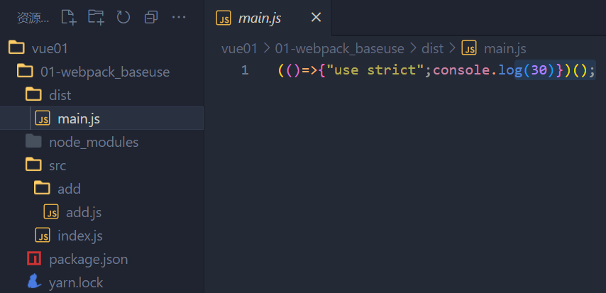
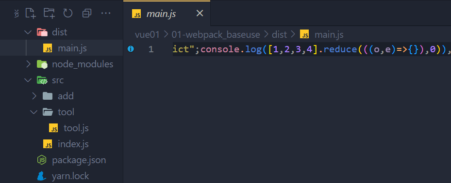
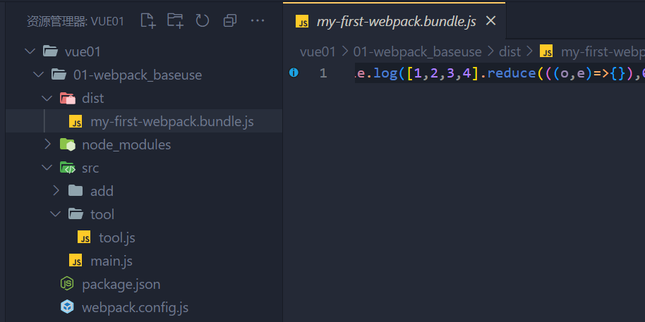

# webpack 使用

#### 一 ：初始化环境，（创建package.json）

`package.json`是一个项目描述文件, 里面记录了当前项目的信息。eg: 项目名称、版本、作者、[gitHub](https://so.csdn.net/so/search?q=gitHub&spm=1001.2101.3001.7020)地址、当前项目依赖哪些第三方模块等。 使用`npm`安装第三方模块，是模块的相关信息会自动添加到`package.json`文件中。它在项目中扮演着记录员的角色

```javascript
yarn init
```

#### 二 ：安装依赖包

**-D  ： 开发依赖包**

```javascript
yarn add webpack webpack-cli -D
```

#### 三：配置scripts(自定义命令)

```javascript
"scripts": {
	"build": "webpack"
}
```

#### 四：使用`webpack`打包两个`js`文件
>必须放到src文件夹下，webpack会默认去src文件夹下找文件打包
>新建目录src

第一个js文件：
>新建src/add/add.js - 定义一个求和函数并导出
```
export const addFn = (a, b) => a + b
```
第二个js文件：
>新建src/index.js导入add.js并使用
>
>>这个src/index.js文件是默认的webpack打包入口，一定要这么写
>>

```
// webpack打包的入口
// 按需导入使用{}
import {addFn} from './add/add'

console.log(addFn(10, 20));
```
运行打包命令：
```
yarn build
#或者 npm run build
#或者 cnpm run build
```
**总结**：src的兄弟文件夹, 生成默认dist目录和打包后默认main.js文件




#### 五：webpack更新打包

> 新建`src/tool/tool.js` - 定义导出数组求和方法

```
export const getArrSum = arr => arr.reduce((sum, val) => sum += val, 0)	
// or
export const getArrSum = arr => {
    return arr.reduce((sum, val) => {
        sum += val
    },0)
}
```
> src/index.js - 导入使用 
```
// webpack打包的入口
// 按需导入使用{}  -----------------  默认导入 import 名字 from '相对路径'
import {addFn} from './add/add'
import {getArrSum} from './tool/tool'

console.log(addFn(10, 20));
console.log(getArrSum([1, 2, 3]));
```
>重新打包
```
yarn build
#或者 npm run build
#或者 cnpm run build
```


>总结：
>src中是开发环境， 与dist打包后的文件相互独立
>打包后格式压缩，变量压缩（体积更小）

#### 六：webpack 配置

>  webpack配置 - webpack.config.js(默认)
>
> 新建`webpack.config.js`
>
> > 	与package.json同级

> 填入配置项
>
> 1. 将默认入口`index.js`改成`main.js`
>
> 2. 填入配置
>
```
// path 模块提供了一些实用工具，用于处理文件和目录的路径。
const path = require("path")

module.exports = {
    entry: "./src/main.js", // 入口 注意是相对路径
    output: { // 出口
         // __dirname 表示当前文件：webpack.config.js 的当前文件的目录名
        path: path.join(__dirname, "dist"), // 出口路径 文件夹名称
        filename: "bundle.js" // 出口js文件名
    }
}
```
打包：
```
yarn build
```




前面写了一个隔行换色的案例，但是使用的 index.html 要自己放到 dist 下面 或者 js文件 引入路径要从 dist 里面引入

#### 七  部分插件的使用
1. 插件-自动生成html文件

> 下载插件
```
yarn add html-webpack-plugin -D
```

> webpack.config.js配置
```
const HtmlWebpackPlugin = require('html-webpack-plugin')

plugins: [ // plugins插件配置
        new HtmlWebpackPlugin({
            template: './public/index.html' // 告诉webpack使用插件时, 以我们自己的html文件作为模板去生成dist/html文件
        })
    ]
```

重新打包后观察dist下是否多出html并运行看效果

> 总结: webpack.config.js就是一个配置表，需要的功能就在config中配置

2. 加载器处理css文件 
   
   ​	
   
   [style-loader文档](https://webpack.docschina.org/loaders/style-loader/)
   
   [css-loader文档](https://webpack.docschina.org/loaders/css-loader/)
   
   
   
   1. 安装依赖
```
   yarn add style-loader css-loader -D
```
   2. webpack.config.js 配置

```
   module.exports = {
    // ... 未修改代码省略
    module: { // 加载器配置
        rules: [ // 规则
         { // 一个具体的规则对象
                test: /\.css$/i, // 匹配.css结尾的文件
                use: ["style-loader", "css-loader"], // 让webpack使用这2个loader处理css文件
                // 执行顺序是从右到左的, 所以不能颠倒顺序
                // css-loader: webpack解析css文件-把css代码一起打包进js中
                // style-loader: css代码插入到DOM上 (style标签)
            },
        ],
    },
   }
```

   > 总结: 万物皆模块, 引到入口, 才会被webpack打包， 如：css打包进js中, 然后被嵌入在style标签插入dom上

   

3. 加载器处理less文件 

   [less-loader文档](https://webpack.docschina.org/loaders/less-loader/) webpack 将 Less 编译为 CSS 的 loader。

   1. 下载依赖包
```
yarn add less less-loader -D
```
   2. webpack.config.js 配置
```
   module.exports = {
    // ...省略其他
    module: { // 加载器配置
        rules: [ // 规则
            {
                test: /\.css$/i,
                use: ["style-loader", "css-loader"]
            },
            {
                test: /\.less/,
                use: ['style-loader', 'css-loader', 'less-loader']
            }
        ]
    }
}
```
> 总结: 只要找到对应的loader加载器, 就能让webpack处理不同类型文件  

4. 加载器 - 处理图片文件

   [asset-modules文档 ](https://webpack.docschina.org/guides/asset-modules/) 资源模块(asset module)是一种模块类型，它允许使用资源文件（字体，图标等）而无需配置额外 loader。

   *注： 如果使用的是webpack5版本的（现在一般也是用的webpack5）, 直接配置在webpack.config.js - 的 rules里即可*

```
{
    test: /\.(png|jpg|gif|jpeg)$/i,
    type: 'asset'
}
```

[url-loader文档](https://webpack.docschina.org/loaders/url-loader/) 它把文件转换成base64 uri

[file-loader文档](https://webpack.docschina.org/loaders/file-loader/) 将文件上的import/require()解析为一个url，并将该文件发送到输出目录。

1. 下载依赖包

```
yarn add url-loader file-loader -D
```

2. webpack.config.js 配置

```
module.exports = {
    // ...省略其他
    module: { // 加载器配置
        rules: [ // 规则
            {
                test: /\.css$/i,
                use: ["style-loader", "css-loader"]
            },
            {
                test: /\.less/,
                use: ['style-loader', 'css-loader', 'less-loader']
            },
            { // 图片文件的配置(仅适用于webpack5版本)
                test: /\.(gif|png|jpg|jpeg)/,
                type: 'asset' // 匹配上面的文件后, webpack会把他们当做静态资源处理打包
                // 如果你设置的是asset模式
                // 以8KB大小区分图片文件
                // 小于8KB的, 把图片文件转base64, 打包进js中
                // 大于8KB的, 直接把图片文件输出到dist下
            }
        ]
    }
}
```
5. 加载器 - 处理字体文件
   1. webpack.config.js - 准备配置
   webpack5使用这个配置
```
   { // webpack5默认内部不认识这些文件, 所以当做静态资源直接输出即可
              test: /\.(eot|svg|ttf|woff|woff2)$/,
                type: 'asset/resource', // 所有的字体图标文件, 都输出到dist下
                generator: { // 生成文件名字 - 定义规则
                    filename: 'fonts/[name].[hash:6][ext]' // [ext]会替换成.eot/.woff
                }
}
```

   webpack4及以前使用下面的配置
```
{ // 处理字体图标的解析
    test: /\.(eot|svg|ttf|woff|woff2)$/,
        use: [
            {
                loader: 'url-loader',
                options: {
                    limit: 2 * 1024,
                    // 配置输出的文件名
                    name: '[name].[ext]',
                    // 配置输出的文件目录
                    outputPath: "fonts/"
                }
            }
        ]
}
```
 6. 加载器 - 处理高版本js语法(面试小点)

[babel-loader文档](https://webpack.docschina.org/loaders/babel-loader/)

1. 安装包

 ``` 
yarn add -D babel-loader @babel/core @babel/preset-env
 ```
2. 配置规则
```
{
    test: /\.m?js$/,
        exclude: /(node_modules|bower_components)/, // 不去匹配这些文件夹下的文件（防止影响其他第三方依赖包）
            use: {
                loader: 'babel-loader', // 使用这个loader处理js文件
                    options: { // 加载器选项
                        presets: ['@babel/preset-env'] // 预设: @babel/preset-env 降级规则-按照这里的规则降级我们的js语法
                    }
            }
}
```

7. webpack-dev-server自动刷新(dev环境 - 今后使用会像呼吸一样的自然)
   
   1. 下载模块
```
yarn add webpack-dev-server -D
```
   2. 配置自定义命令
```
scripts: {
    "build": "webpack",
    "serve": "webpack serve"
}
```
   3. 运行命令-启动webpack开发服务器
```
yarn serve
# 或者 npm run serve
```
如果运行代码报错或者警告
```
"scripts": {
    "build": "webpack --mode production", // 生产环境
    "serve": "webpack serve --mode development" // 开发环境
  },
```
8. webpack-dev-server配置（自定义端口号）

在webpack.config.js中添加服务器配置
更多配置参考这里: https://webpack.docschina.org/configuration/dev-server/#devserverafter

```
module.exports = {
    // ...其他配置
    devServer: {
        port: 3000 // 端口号
    }
}
```


yarn add style-loader css-loader -D  可以
但是  npm install --save-dev css-loader 不行


